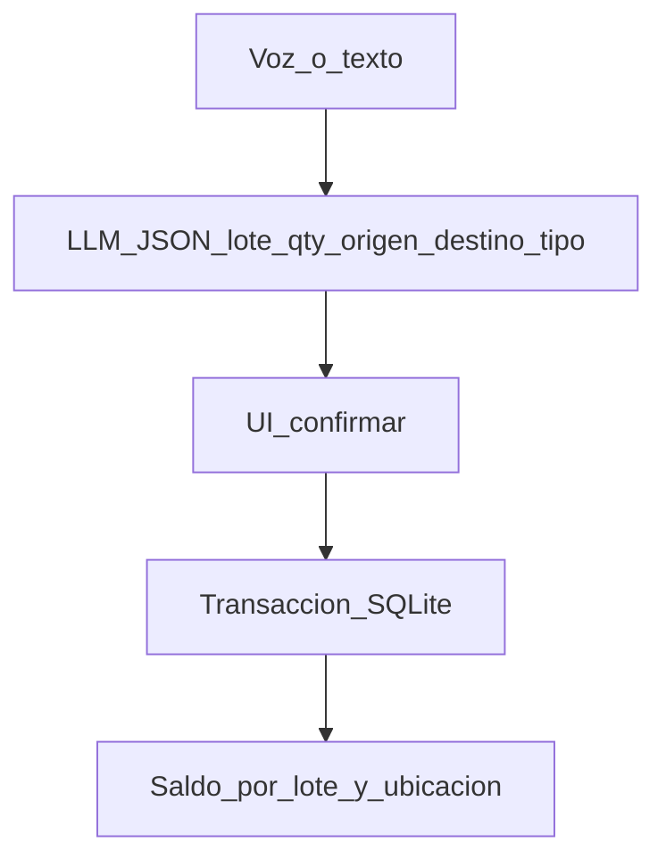

# Plan de implementación N01 (con la planilla real)

La planilla [fuentes/Planilla de movimientos 2026.xls](fuentes/Planilla de movimientos 2026.xls) **no es un inventario**: es un **libro de remitos** en 12 hojas. El stock por ubicación no está calculado (las hojas `Stocks`, `DJ Panc` y `SP` están vacías o son producción de chacra). El sistema tiene que **reemplazar esas hojas** por un saldo único, no clonar el Excel.

Al implementar, borrar los dumps temporales `_xls_dump.txt` y `_xls_uniques.txt`.

## Qué dice la planilla (hechos)

**Flujos operativos (hojas con datos):**

- **De campo a Frío** — ingreso desde chacra. Destino solo `dospanca` o `galpon`. Campos: remito, fecha, variedad, lote, kg, transporte, destino, bolsas, observaciones/DTV.
- **Ingreso Tolvas Santa Ana** — ingreso a planta (granel). Destino implícito: Santa Ana. No es una de las 4 bodegas del brief.
- **Env a Frio** — envío a frío. Destinos: `dospanca`, `cecive`, `belmonte`, `galpon-galpon`. Extra: categoría, calibre (`exportacion`, `sin chicas`, `recibo`).
- **Ret Frio** — salida de frío. Origen: `dospanca`, `cecive`, `belmonte`, `sasula balcarce`. El destino real a menudo va en observaciones (cliente / Paraguay).
- **Ingreso Trevelin** — semilla que entra (otra procedencia). Color de bolsa/hilo = identificación física del lote.
- **Entregas a clientes 2026** — egreso a ~62 clientes (Parmentier, Delcaso, Papalini, Frigopap, etc.).
- **P.Chica / Stocks / DJ Panc / SP / Transportes / Frigoríficos** — fuera de alcance (vacías, 2025, o producción agrícola).

**Catálogo extraído:** ~106 lotes, ~37 variedades, unidad de piso **bolsas** (kg ~50 kg/bolsa, se guarda como dato secundario).

**Las 4 ubicaciones del brief** (nombres canónicos + alias de la planilla):

- Frigorífico Dos Pancani — `dospanca`, pancani, dos panca
- Frigorífico Cecive — `cecive`
- Frigorífico Belmonte — `belmonte`
- Galpón — `galpon`, `galpon-galpon`

`sasula balcarce` aparece como origen de retiro: tratarlo como **ubicación externa** (no cuenta para el tablero de 4, sí puede figurar en un egreso). Santa Ana / Campo / Trevelin son **orígenes de ingreso**, no las 4 bodegas.

## Qué NO construir (YAGNI)

- Un módulo por hoja de Excel.
- Importador .xls en runtime.
- CRM de 62 clientes, fletes, DTV, colores de hilo, calibres, papa chica 2025.
- Login, roles, gráficos de producción por hectárea.

Sí guardar en el movimiento, si el operador lo dice: remito y observaciones (texto libre). El resto queda en `notas`.

## Modelo mínimo

Tres tablas (SQLite):

- `locations` — las 4 bodegas (+ `campo_santa_ana` y `externo` solo para ingresos/egresos, ocultas o agrupadas en UI).
- `lots` — `code` (ej. `241`, `37A`), `variety` (Agata, Spunta…), opcional `kg_per_bag`.
- `stock` — `(lot_id, location_id, bags)` único. Saldo actual.
- `movements` — append-only: tipo, lote, cantidad bolsas, kg opcional, origen, destino, remito, nota, `raw_text`, `created_at`. Nunca borrar saldo a mano: el saldo sale de aplicar movimientos.

Tipos de movimiento (un solo endpoint):

| tipo | de la planilla | efecto |
| ingreso | De campo a Frío, Env a Frio, Tolvas, Trevelin | suma en destino (origen puede ser Campo) |
| transferencia | entre las 4 bodegas | resta origen, suma destino; **falla si origen no alcanza** |
| egreso | Ret Frio / Entregas | resta origen; **falla si no alcanza** (demo “se descubre en la entrega”) |

Unidad que valida la IA y el operario: **bolsas**. Kg es informativo.

## Datos de demo (no reconstruir 2026 entero)

Reconstruir saldos reales sumando todas las hojas es frágil (filas vacías, destinos en observaciones, “s/remito”). Para el hackathon:

1. Catálogo real: lotes y variedades que aparecen en la planilla.
2. **Seed de saldos** en las 4 bodegas para ~15–25 lotes frecuentes (ej. Agata 241, 224, 240; Spunta 300/310/50; Asterix 810/820/821; Daifla 351), con cantidades creíbles en bolsas.
3. Frases de demo alineadas a esos lotes.

Archivo estático `data/seed.json` (no parsear el .xls en cada arranque). Extraer a mano/script una vez.

## App (un solo proceso)

Next.js (App Router) + SQLite (`better-sqlite3`) + una pantalla con look de sistema de gestión (regla de UI del repo: claro, tarjetas, tabla legible, no “export de DB”).

**Pantalla única (o dos pestañas):**

1. **Registrar** — textarea + micrófono; preview del JSON; Confirmar / Cancelar; mensaje de rechazo en español (“En Dos Pancani el lote 241 tiene 400 bolsas; pediste 600”).
2. **Stock** — tabla: variedad, lote, 4 columnas de bolsas (una por ubicación), total. Filtro por variedad/lote.
3. **Últimos movimientos** — lista corta debajo.

API:

- `GET /api/stock`
- `GET /api/catalog` (lotes + ubicaciones + alias, para el prompt)
- `POST /api/parse` — texto → JSON estructurado (sin persistir)
- `POST /api/movements` — aplica si hay stock; 409 si no alcanza

Parser: LLM con JSON estricto y **lista de alias + lotes inyectada**. Campos: `tipo`, `lote`, `variedad?`, `bolsas`, `origen`, `destino?`, `remito?`. Si no hay `OPENAI_API_KEY` (u otra compatible), fallback por reglas/regex sobre los mismos alias para que la demo no muera.

Voz: Web Speech API del navegador → mismo textarea. Frases de backup en un bloc.

## Orden de build (igual que la guía anterior)

1. Schema + seed + tabla de stock visible.
2. `POST /api/movements` con transacción y chequeo de saldo (formulario mínimo oculto o de respaldo).
3. Parseo NL + confirmación.
4. Micrófono.
5. Guión de 2–3 min: vista única → transferencia OK → egreso/transferencia rechazada por falta de stock.

## Demo (usar lenguaje de la planilla)

- “Pasá 80 bolsas del lote 241 Agata de Dos Pancani al galpón.”
- “Retirá 600 del 241 de Pancani” cuando el saldo es menor → bloqueo (el problema real de la entrega).
- No hace falta completar remito ni DTV para que cuente.
